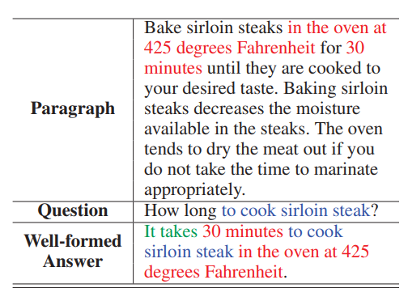
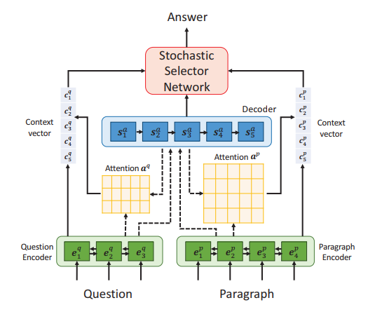
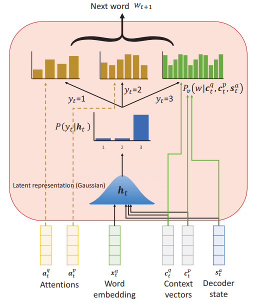

# Alpha Solution for KQA Sys

### Algorithm

:fire: **preliminary**

[LatentQA](https://ojs.aaai.org//index.php/AAAI/article/view/6238) :                         $\underbrace{Paragraph}$-Question-Answer (answer generated by <u>extraction</u> and <u>reformulation</u>) 

Ours w/ knowledge:    	$\overbrace{Background}$-Question-Answer-$\underbrace{Case\ Base (or\ masked)-Law\ Base}$

​												                			                     	     			$Knowledge\ (text)$

Ours w/o knowledge:           $\overbrace{Case}$-Question-Answer

where background is the event without judgment, case is the event with judgment.

`we can remove the case base if we generate well-formed answer, or use case base to guide the alignment (matching)`

`we can not remove but mask the case base (judgment) if we generate free answer `

`free answer : generate the words which are not in the text`

`well-formed answer : extract the words from the text and reformulate them, which is similar to pointer-generator method (i.e. copy mechanism)`

:fire: **basic QA algorithm**

paper : [LatentQA](https://ojs.aaai.org//index.php/AAAI/article/view/6238)

​                		$\underbrace{sample}$                                             $\underbrace{architecture} $                       $\underbrace{stochastic\ selection\ network}$

:fire: **knowledge enhancement** (analyze and experiment in order)

​	:one: search the knowledge given the background and question (long text matching)

- [x] (search online) use TF-IDF model to calculate text similarity (background-case, question-law)

- [ ] (search online) extract the abstract of background/keyword of question,  and then search the nearest case/law, resp.

​	:two: get the span of knowledge and background given the question (short span matching)

- [x] (search online) use existing algorithm for span extraction (uni- or multi-) on github

​	:three: represent the knowledge, background and question

- [x] (search online) all in graph : seq2graph method (e.g. [OpenIE](https://openie.allenai.org/))
- [ ] (search online) seq2graph2embedding : question/background in text, but knowledge is in seq2graph2embedding (graph embedding can be [TransE](https://proceedings.neurips.cc/paper/2013/file/1cecc7a77928ca8133fa24680a88d2f9-Paper.pdf) or other).
- [ ] (search online) part in graph : question/background in text, but knowledge in graph for example.
- [ ] (search online) in word embedding : dynamic (i.e. BERT) (or static (i.e. GloVe) )

- [ ] (search online) in graph embedding : seq2graph and then convert graph to low-dim vector.

​	:four: :star2: infuse the knowledge into the basic model and modify the model accordingly

**space** : We can see from step :three: that there are 3 space types : word embedding (WE), node embedding (graph) (NE), graph embedding (GE). We adopt appropriate methods accordingly. For each one or each combination, we can find the corresponding work, which is, typically,  [K-BERT](https://arxiv.org/abs/1909.07606v1) (WE+NE), [ERNIE](https://aclanthology.org/P19-1139.pdf) (WE+GE or WE+WE), [KEPLER](https://arxiv.org/abs/1911.06136) (WE+GE), [K-Adapter](https://arxiv.org/abs/2002.01808) (ALL)... We can see that there lack some combinations, which can be added into our idea list.

**order** : But ATTENTION : graph-form is counted in NE (no aggregation), text-form is counted in WE (rarely not embeded). What we need to pay attention to is when we embed. For example, [K-BERT](https://arxiv.org/abs/1909.07606v1) does embedding after concatenation (knowledge fusion). [KEPLER](https://arxiv.org/abs/1911.06136) does WE before GE (aka entity embedding), where GE can be seen as knowledge fusion. Hence, the embedding order can be categorized into three types : pre-embedding, in-embedding, post-embedding. We can further enrich the idea list based on this.

**method** : the last and main focus is how do we perform knowledge fusion.

- [x] summation (NE+NE): after node embedding (k-hop neighborhood aggregation using [GCN](https://arxiv.org/abs/1609.02907) or [GAT](https://arxiv.org/abs/1710.10903)), just add up the signal matrix (laplacian) of question graph and case (background) span graph and       			                   knowledge span graph.
- [ ] concatenation : see [K-BERT](https://arxiv.org/abs/1909.07606v1), we can use NER/POS as intermediary. see also [this paper](https://arxiv.org/abs/2009.13401) for more inspiration
- [ ] alignment : see [ERNIE](https://aclanthology.org/P19-1139.pdf)
- [ ] encoder. : see [K-Adapter](https://arxiv.org/abs/2002.01808), [KEPLER](https://arxiv.org/abs/1911.06136)

`the case base can give a guidance for alignment`

​	:five: generate the free answer or well-formed answer

`free answer : generate the words which are not in the text`

`well-formed answer : extract the words from the text and reformulate them, which is similar to pointer-generator method (i.e. copy mechanism)`

Different representation spaces, different orders and different methods need different generation strategy. But the framework is almost the same : encoder-decoder mechanism.

- [x] [graph2seq](https://arxiv.org/abs/1804.00823)
- [ ] path based knowledge graph reasoning, see [the survey](https://arxiv.org/abs/2010.04389v1).
- [ ] (search online) seq2seq : bert, etc.
- [ ] others : [seqgan](https://arxiv.org/abs/1609.05473), copy mechanism (c.f. [the survey](https://arxiv.org/abs/2010.04389v1)), etc.

### Task

:fire: **work pipeline**

:a: implementation of basic QA algorithm (runnable) (ours w/o knowledge) $\to$ :b: improvement by knowledge guidance (ours w/ knowledge) $\to$ :bulb: experiment by other ideas (listed in the work detail section)

:fire: **work matrix**

| **member**      | :a:                                  | :b:                                                          | :bulb:          |
| --------------- | ------------------------------------ | ------------------------------------------------------------ | --------------- |
| Zekun           | guidance, with Zhaoze                | guidance                                                     | decision        |
| Zhaoze          | with Yibo                            | with Yibo                                                    | coding          |
| Yibo            | with Yakun                           | with Yakun, with Zhaoze                                      | coding          |
| Yakun           | fondamental text processing, dataset | knowledge retrieval                                          | coding (assist) |
| **description** | pure basic QA algorithm              | according to the methodology introduced in the knowledgeable TG papers | enrichment      |

`QA : Question Answering; TG : Text Generation`

:fire: **work detail** 

:a: : how to re-produce the algorithm introduced in [LatentQA](https://ojs.aaai.org//index.php/AAAI/article/view/6238)

- :star2: *Zhaoze* does work related to <u>sequence-to-sequence model, stochastic selector networks and model learning</u>, i.e. all of the architecture.
- *Yakun* does work related to <u>dataset preparation (case base, law base, question), extraction of background from case, retrieval of case&law from background&question</u>.
- *Yibo* does work related to <u>span extraction (i.e. based on the background, match a $span$ of case and law with the question), knowledge embedding (Seq2Graph([OpenIE](https://openie.allenai.org/)), encoder, or other)</u>.
- :star2: *Zekun* makes <u>work evaluation, decision, debug guidance, work guidance, coding, etc</u>. 

:b: : how to improve the performance by knowledge-enhancement methods

- *Zhaoze* <u>modifies</u> the work that have been done to adapt to the improvement (knowledge fusion) (e.g. replace stochastic selector networks by graph2seq, or other decoder, etc.).
- *Yakun* <u>improves</u> his work and provides fondamental text processing <u>continuously</u>.
- :star2: *Yibo* helps to <u>fuse the knowledge embedding</u> into the whole model, which includes the <u>finer alignment (matching) and integration</u> of question, knowledge and background.
- :star2: *Zekun* makes <u>work evaluation, decision, debug guidance, work guidance, coding, etc</u>. 

:bulb: : how to enrich originality and further improve performance

​	:question: training with judgment information (mask or other strategy). i.e. how to make full use of the rich information of the judgment in the case base

​	:question: utilisation of TransE of improvement of TransE, whose principle is not very intuitive

​	:question: pre-trainization (ours$\to$pre-trained, better KG$\to$pre-trained strategy)

​	:question: more combination between NE (node embedding), WE (word embedding) and GE (graph embedding)

​	:question: more combination between representation, order and method

​	:question: creative generation strategy, e.g., Knowledge-guided SeqGAN

​	:question: another seq2graph method

​	:question: graph morphing module : for alignment between graphs for example

​	:question: improvement of general adapter (c.f. [K-Adapter](https://arxiv.org/abs/2002.01808))

​	:question: better word embedding strategy to solve big vocabulary problem : sub-word embedding, only high-frequency, hierarchical (dim=2, from categories to words) embedding, how to put into pre-trained model ?

​	:question: structure-aware knowledge embedding (how to embed sub-graph, etc.)

​	:question: entity masking : masking mechanism for pre-trained model with KG

